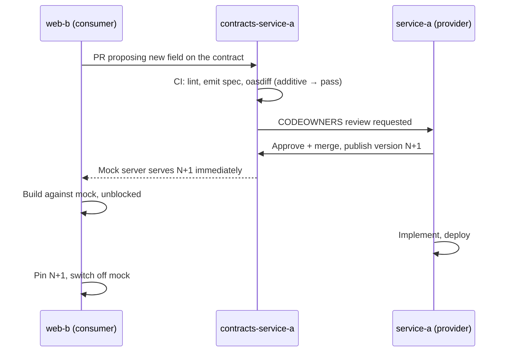

# API Contract Governance — MVP Spec

**Status:** design input, not implementation instructions
**Audience:** planning / architecture agents and the humans reviewing their output
**Stack:** TypeScript, Node, PostgreSQL, DrizzleORM, pnpm monorepo

---

## 0. Purpose and how to read this

This document defines the **target shape** of a contract governance setup for a
multi-team TypeScript monorepo. It specifies rules, gates, package boundaries
and workflows. It deliberately does **not** specify file contents, function
signatures, or framework wiring — those are the planning agent's job.

Two things this document is for:

1. Constraining what gets built, so the agent does not invent a different
   architecture.
2. Making the **non-negotiable rules** in §2 explicit, because they are the ones
   an agent will otherwise violate while trying to be helpful.

### The problem being solved

Frontend teams are blocked on backend availability for API *definitions*, not
API *implementations*. The backend team owns the contract and is the only party
who can author it, so every frontend requirement queues behind backend capacity.

The fix is not more backend capacity. It is **separating authorship from
ownership**: consumers author contract proposals, providers approve and own
them, and a mock server derived from the contract unblocks the consumer the
moment the proposal merges — before any implementation exists.

---

## 1. Repository layout

```
repo/
├── apps/
│   ├── web-a/                  # consumer, owned by team A
│   └── web-b/                  # consumer, owned by team B
├── services/
│   ├── service-a/              # provider, owned by team A
│   └── service-b/              # provider, owned by team B; consumes service-a
├── packages/
│   ├── contracts-service-a/    # published contract for service-a
│   ├── contracts-service-b/    # published contract for service-b
│   ├── db/                     # drizzle schema + migrations
│   └── contract-tooling/       # shared lint rules, CI scripts, generators
└── .github/
    └── CODEOWNERS
```

**Key relationships to model in the MVP:**

| Consumer  | Provider  | Why it matters                                 |
| --------- | --------- | ---------------------------------------------- |
| web-a     | service-a | Same team. Tests the "no ceremony needed" case |
| web-b     | service-a | Cross-team. The actual governance case         |
| service-b | service-a | Service-to-service. Tests provider-as-consumer |

`service-b` consuming `service-a` is required. It demonstrates that ownership
shifts and that today's provider is tomorrow's consumer.

---

## 2. Non-negotiable rules

These exist because they are the failure modes. An agent that "simplifies" any
of these has broken the design.

### 2.1 API schemas are never derived from database tables

`drizzle-zod` / `drizzle-typebox` generate schemas from Drizzle tables. **Do not
use them for anything in `packages/contracts-*`.**

Contract schemas are hand-authored in the contract package. A mapping layer in
the service translates between the DB row type and the contract type. The
mapping is explicit code, and it is where column renames stop being breaking
changes.

Deriving the contract from the table publishes your database schema to every
consumer and makes every migration a potential contract break.

Generated-from-table schemas are acceptable **inside** a service for internal
repository/query layers. They must not be exported from a contract package.

### 2.2 Contract packages are pinned exactly, never ranged

Consumers depend on `"@org/contracts-service-a": "3.2.1"`. No `^`, no `~`.

The friction is deliberate. Adopting a new contract version must be a reviewed
PR in the consumer's repo, because that PR is the record of which consumer is on
which version.

### 2.3 Every request carries a consumer identity

A `client_id`, derived from credentials, logged on every request alongside
endpoint and contract version. Not `User-Agent`.

This is required in the MVP even though there are only three consumers. Every
later capability — usage telemetry, per-consumer rollout, field retirement,
knowing who to notify — is impossible to add retroactively without it.

### 2.4 Schema constructs that cannot be published are forbidden in contracts

If the emitted JSON Schema does not state a rule, the rule does not exist as far
as consumers are concerned, and `oasdiff` cannot detect changes to it.

Concretely:

- Cross-field rules go in JSON Schema `if`/`then` / `dependentRequired`, or they
  go in the error catalogue. They do not go in a Zod `.refine()` inside a
  contract package.
- No `.transform()` in contract schemas. Domain coercion happens in the service
  handler, after parse.
- If Zod is used, `z.toJSONSchema()` runs with `unrepresentable: "throw"` in CI.
  Never `"any"` — that emits `{}` and the build passes with a contract that says
  nothing.

TypeBox is the default choice for contract packages precisely because it makes
this rule structural rather than a convention someone has to remember.

### 2.5 Response tolerance, request strictness

- Consumers ignore unknown response fields. Always.
- Providers reject unknown request fields, because provider-first deploy
  ordering is achievable here.
- Every enum includes an explicit unknown member and consumers handle it.
  Adding an enum value is otherwise a silent break.
- One convention for `null` vs absent, encoded in the linter, applied
  everywhere.

---

## 3. Package responsibilities

### `packages/contracts-<service>`

The published contract. Exports:

- Schemas (TypeBox, or Zod restricted per §2.4)
- An emitted OpenAPI document, committed as a build artifact
- The typed contract object consumed by both server and client
- Nothing that imports from `packages/db`

Owned by the provider team via CODEOWNERS. Consumers open PRs against it;
providers approve. **This is the mechanism that unblocks the frontend.**

### `packages/db`

Drizzle schema and migrations. Owned by the service teams. Explicitly not a
dependency of any contract package. A lint rule enforces this.

### `packages/contract-tooling`

Shared CI machinery so each service does not reinvent it:

- The house lint ruleset (Spectral format)
- The spec emit script
- The `oasdiff` invocation and its breaking-change ruleset
- The mock server launcher

---

## 4. Tier model, expressed as gates

The tiers in the presentation describe *coordination cost*. Here they are
restated as things CI actually does.

| Tier | Gate                                                          | Blocks                       | Needs human agreement |
| ---- | ------------------------------------------------------------- | ---------------------------- | --------------------- |
| 0    | Spec emitted, linted, diffed against last published           | The provider's own PR        | No                    |
| 1    | `client_id` logged; usage queryable per consumer/version      | Nothing — observability only | No                    |
| 2    | Contract package version bump reviewed by provider CODEOWNERS | Consumer's adoption PR       | Yes — one approval    |
| 3    | Registry or cross-language enforcement                        | —                            | **Out of MVP scope**  |
| 4    | Review board                                                  | —                            | **Out of MVP scope**  |

**Tier 3 may never be needed for a pure TypeScript stack.** A pinned npm
contract package plus CI gates covers what a schema registry would. Tier 3
becomes real only on a specific trigger (§7).

---

## 5. Toolchain

| Job                        | Tool                      | Notes                                                  |
| -------------------------- | ------------------------- | ------------------------------------------------------ |
| Schema authoring           | **TypeBox**               | Schema *is* JSON Schema; no lossy conversion           |
| Contract shape             | **ts-rest** or **oRPC**   | Typed client + server from one contract, emits OpenAPI |
| Breaking-change detection  | **oasdiff**               | Two-spec comparison; has a GitHub Action               |
| Spec linting / house rules | **`@quobix/vacuum`**      | Spectral-ruleset compatible, Go, fast                  |
| Mock server                | Prism or equivalent       | Serves the contract before implementation exists       |
| Types for consumers        | From the contract package | Not from a generator                                   |

### Notes on choices

- **vacuum over Spectral.** The Spectral *ruleset format* is the standard; the
  Spectral *tool* has stalled (14 months between releases, unaddressed
  supply-chain report, install-time telemetry added mid-2026). vacuum consumes
  Spectral rulesets and is actively maintained.
- **Zod is not banned.** It is the better choice for env parsing, form input,
  and internal coercion. It is restricted only inside contract packages, for the
  reason in §2.4. If Zod v4 is used there, `z.toJSONSchema()` is the emit path —
  `@asteasolutions/zod-to-openapi` was the Zod v3 answer.
- **No OpenAPI client generator in the MVP.** The contract package already gives
  typed clients. Generation is for consumers outside the monorepo, which do not
  exist yet.
- **No Pact in the MVP.** Consumer-driven contract testing earns its cost when
  consumers are cross-language or outside the repo. Revisit at the §7 trigger.

---

## 6. Workflows

### 6.1 The unblocking flow — consumer needs a new field

This is the primary workflow. It is the reason the whole setup exists.



The frontend is unblocked at the merge, not at the deploy. Provider review is
one approval on a small diff, not a design meeting.

### 6.2 Provider makes a breaking change

1. `oasdiff` fails the provider's PR.
2. Provider either makes the change additive, or opens a contract major version.
3. A major version requires: a migration note in the contract package, and the
   list of affected consumers pulled from `client_id` usage data.
4. Old version stays published. Consumers migrate on their own PRs.

### 6.3 New consumer appears

1. Consumer requests a `client_id`. Issued with a named owner. This is
   registration, not approval — the provider cannot say no, but now knows.
2. Consumer pins a contract version.
3. Their usage appears in provider telemetry from the first request.

### 6.4 Field retirement

Included in the MVP because it is the question the design must be able to answer
even if it is not exercised yet.

1. Mark deprecated in the contract; the linter requires a sunset date alongside.
2. Query usage by `client_id` for that field or endpoint. Retain at least 13
   months of rollups — quarterly and annual jobs are invisible in 30 days.
3. Notify named owners.
4. Remove only when usage is zero, or after per-consumer disablement for those
   who have migrated.

---

## 7. Explicitly out of scope, with triggers

| Deferred                          | Adopt when                                               |
| --------------------------------- | -------------------------------------------------------- |
| Pact / CDC broker                 | A consumer is outside the monorepo, or non-TypeScript    |
| Schema registry (Apicurio et al.) | A non-TS producer exists, or events over Kafka appear    |
| Generated SDKs (Fern / Stainless) | An external partner needs a published SDK                |
| API review board                  | Two teams want incompatible changes to the same resource |
| Date-based / header versioning    | A consumer whose release cadence you don't control       |

Adopting any of these before its trigger costs coordination and buys nothing,
and makes the whole system look like bureaucracy — which poisons it for when it
is actually needed.

---

## 8. CI gate order

Per PR touching a contract package, in order, each blocking:

1. **Emit** — build the OpenAPI artifact from the schemas. Fails on
   unrepresentable constructs.
2. **Lint** — vacuum against the house ruleset.
3. **Diff** — oasdiff against the last published artifact.
4. **Dependency check** — no contract package imports `packages/db`.
5. **Publish** — version bump on merge to main.

House lint rules the ruleset must include:

- No typeless or empty (`{}`) schemas
- `additionalProperties` set explicitly on every object
- Every enum has an unknown member
- Deprecated operations carry a sunset date
- `operationId` present; error responses conform to the shared error schema

---

## 9. Acceptance criteria for the MVP

The MVP is done when all of these are demonstrable:

1. A consumer PR adds a field to `contracts-service-a`, CI passes, provider
   approves, and `web-b` builds against a mock of the new version with zero
   backend code written.
2. A PR that removes a field from `contracts-service-a` is blocked by CI with a
   readable message naming the break.
3. A PR that exports a Drizzle-derived schema from a contract package is blocked
   by CI.
4. A query returns which `client_id`s called which endpoint at which contract
   version over the last 30 days.
5. `service-b` consumes `contracts-service-a` at a pinned version, and bumping
   that pin is a reviewable PR.

---

## 10. Decisions left to the human

Not for the agent to resolve:

1. TypeBox vs Zod-with-guardrails for contract packages. §2.4 makes either
   workable; TypeBox is the default here.
2. ts-rest vs oRPC. ts-rest is more conservative, oRPC more current.
3. Whether `client_id` issuance is manual in the MVP or has an onboarding flow.
4. Whether contract packages are versioned independently or move together.