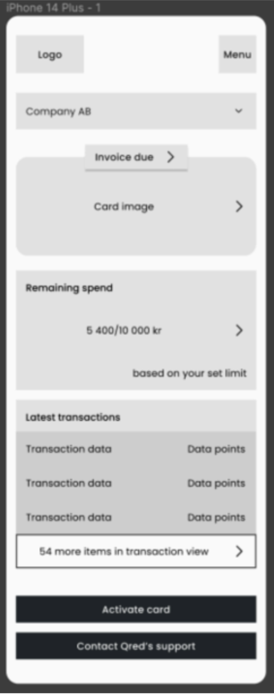

# Case Study
This case looks into the synergy between
you and your colleagues as you contribute to our products.

## Scenario is as follows:
- Developers are required to build new APIs consistently to achieve specific
business objectives.
- The technical competence to specify and support the building of these APIs is currently a
scarce resource, and this slows us down.
- The mobile view shown in Appendix 1 is a frontend view in the mobile app which lacks
an API implementation in the backend.
- The API definition and implementation sometimes occur too late in the software
development lifecycle, which is something we would like to improve upon.
- Product Managers only have limited technical knowledge and require assistance in
describing the technical implementation details for less experienced developers.
- The Frontend Developers are competent and can be frustrated by delays in API
availability.
- We want frontend and backend work to happen smoothly and in parallel.

## Task 1: Collaboration Improvement Presentation
Prepare a short presentation of your thoughts on how to address the problems listed above, to
improve the collaboration between frontend and backend developers in order to work in parallel.
This will help us better understand your problem resolution skills, so feel free to share your
thoughts and elaborate on your plans to enhance the collaboration.
Also, reflect on how your ideas would conform to company's values which are transparency,
innovation, and passion.

## Task 2: API Implementation
Provide an implementation using Node.js and Typescript for the backend part to the frontend
view being displayed in Appendix 1.
Try to cover the following aspects in your delivery:
● Database Schema and Payload Response: Think about the database schema design,
as well as the structure of the payload response. Explain how these will be optimised to
meet the needs of both the frontend (Appendix 1) and backend systems. Feel free to
mock the database locally, or even to use a live one hosted on your personal AWS
account. We are more interested in your thought process at this stage, and in a demo
that will work smoothly without hiccups.
● API Structure: Describe the architecture and organisation of the API to ensure that data
delivery is streamlined for frontend usage and presentation.
● Code Implementation: Execute the API implementation as you see fit, maintaining a
focus on best practices and efficiency.
Please bear in mind that unless you are applying for a full-stack position, then we do not expect
you to build anything on the client side. Also, assume that you have access to an unlimited
budget, complete control over decision-making and execution, along with backing from senior
management.

## Appendix 1: Mobile View
